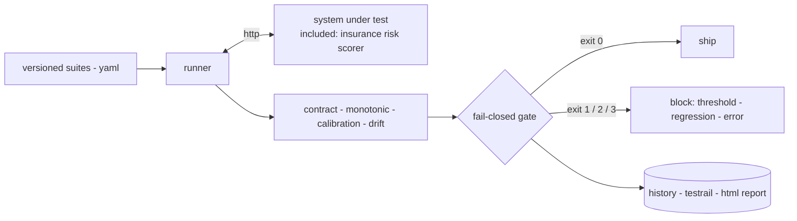

# evalgates

An evaluation harness for model-backed systems: versioned check suites,
a fail-closed release gate with a regression baseline, TestRail-shaped
results, and CI as the merge blocker. Built for the failure class that
schema tests miss - well-formed answers that are quietly wrong - whether
the model behind the service is an LLM or a classical one.

Systems under test plug in behind one client seam - the runner speaks to
them over HTTP, in-process for CI or `--base-url` for anything deployed.
This repo ships one end to end so every claim is verifiable: an insurance
risk scorer, gated release by release. Adding another target is a new
suite file, not new harness code.

## run it

    python -m pip install -r requirements.txt
    python -m pytest tests/ -q                                  # 83 tests
    python -m evalgates.gate --suite suites/release_v1.yaml \
        --baseline baseline.json --report out/report.html       # 12 checks, exit 0
    uvicorn sut.app:app --port 8080                             # the risk service

## the four check families

| family | what it catches |
|---|---|
| contract | broken shapes, a dropped out-of-domain refusal, batch errors, latency |
| monotonic | a risk factor pointing the wrong way while every response stays well-formed |
| calibration | predicted risk levels drifting from observed while ranking metrics stay green |
| drift | the scored population no longer matching the one the release was approved on |

Thresholds are yaml under `suites/` - changing one is a reviewable diff.

## proven able to fail

Each family ships with a seeded-defect test: flip a coefficient sign,
bias the intercept, shift the cohort, drop the refusal - the responsible
family must fail, and does. A harness never seen to fail proves nothing.

## the gate

Exit 0 ship, 1 threshold failure, 2 regression vs baseline, 3 error -
errors block like failures, and a red run can never become the baseline.
History is SQL (`RUNS_DB` is the Postgres seam); results export in
TestRail's bulk shape; each run writes a self-contained HTML report.

## data

Each system under test brings its own data, under the same rules: public
or synthetic sources only, checksummed artifacts, and a fetch script
that reproduces the whole chain - provenance travels with everything
committed, and a test fails the build if the data changes silently.

The included risk scorer is fitted on 677k public motor liability
policies, the standard open dataset for claim frequency - filtered,
sliced, and checksummed by `data/fetch_fremtpl.py`. No client data
anywhere.

## limits

The included scorer models claim frequency only, no severity, and the
harness runs a single latency ceiling rather than load testing. The
service carries no auth - it is a test target, not a production
deployment. And the gate enforces only what its suites define: coverage
is a suite-authoring decision, reviewed like code.
